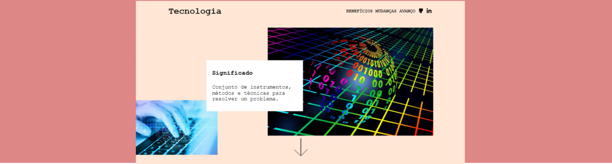
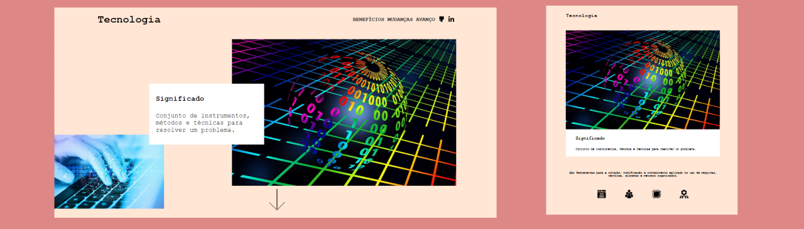

# **Site de Tecnologia**

## Sobre o projeto

Projeto: [trabalho de front-end](https://front-end-site-de-tecnologia.vercel.app/)

Trabalho desenvolvido sobre tecnologia, com uso de flexbox e jQuery, atendendo aos requisitos de estrutura e visual aplicado. 

Work developed on technology, using flexbox and jQuery, meeting the structure and visual requirements applied.

## Layout web e mobile 

## Tecnologias Utilizadas

* HTML 5
* CSS 3
* Flexbox
* jQuery

## Autor

#### **Katarine Albuquerque**

    
    &nbsp;
    

